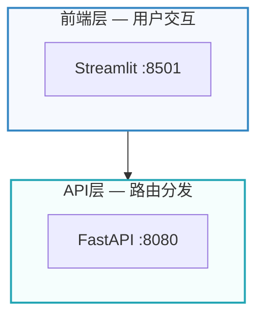
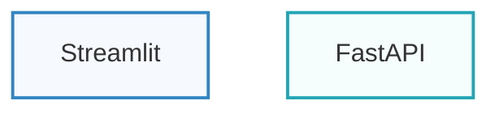

# 架构图绘制指南

## 核心哲学

架构图的本质是**视觉论证**，不是简单的信息罗列。一张好的架构图通过结构本身传达系统的关系与因果逻辑。

### 两个质量测试

**同构测试**: 去掉图中所有文字，仅看结构（框、线、层级、分组），是否仍能传达核心概念？如果去掉文字后图变成一堆无意义的方块，说明结构没有承载信息，需要重新设计布局。

**教育测试**: 读者看完这张图后，是否学到了**具体的**知识？技术架构图必须包含真实的规格信息——端口号、协议名、技术栈、API路径——而非"数据库"、"服务A"这样的占位符。用真实数据替代抽象标签，让图本身就是文档。

### 约束意识

- 每张图控制在 **6-8 个核心节点**，最多不超过 15 个
- 主要关系线不超过 **6 条**
- 超出限制时：拆分为多张图，或提升抽象层级
- 宁可多画几张清晰的图，不画一张大杂烩

---

## 五步画图法

### Step 1: 明受众 — 谁在看？

不同受众需要不同层级的信息：

| 受众 | 关注点 | 合适的图型 |
|------|--------|-----------|
| CEO/业务方 | 系统做什么、与外部如何协作 | C4 Context、功能架构 |
| 架构师 | 技术决策、组件职责划分 | C4 Container、系统总览 |
| 开发者 | 接口协议、调用链、数据流 | 时序图、ER图、状态图 |
| 运维/SRE | 部署拓扑、端口、容器编排 | 部署架构 |
| 项目经理 | 进度、依赖、里程碑 | 甘特路线图 |

先确定受众，再选择图型。为CEO画代码级细节是最常见的错误。

### Step 2: 定图型 — 画什么类型？

| 沟通目标 | 图型 | Mermaid类型 | 模板 |
|----------|------|------------|------|
| 系统全景、各层职责 | 系统总览架构 | `graph TB` + subgraph | templates/system-overview.mmd |
| 系统与外部的关系 | C4 Context | `C4Context` | templates/c4-context.mmd |
| 容器/服务划分 | C4 Container | `C4Container` | templates/c4-container.mmd |
| 模块间调用关系 | 应用/组件架构 | `graph` + flowchart | templates/component.mmd |
| 接口交互时序 | 时序图 | `sequenceDiagram` | templates/sequence-flow.mmd |
| 状态流转逻辑 | 状态图 | `stateDiagram-v2` | templates/state-machine.mmd |
| 数据表关系 | ER数据模型 | `erDiagram` | templates/data-model.mmd |
| 部署拓扑 | 部署架构 | `graph TB` + subgraph | templates/deployment.mmd |
| 项目进度 | 路线图 | `gantt` | templates/roadmap.mmd |

不确定用哪种图型？参见 `references/diagram-types.md` 的决策流程。

### Step 3: 提要素 — 图中有哪些角色？

识别三类要素：

- **实体**: 用户、服务、数据库、外部系统、LLM API
- **分组**: 层级（前端层/API层/数据层）、部署单元（Docker容器组）、域边界
- **关系**: 数据流方向、调用链、依赖、包含

原则：每张图要素总数不超过15个节点。超出则拆分。

### Step 4: 理关系 — 要素之间什么关联？

三种核心关系及其 Mermaid 表达：

| 关系类型 | 语义 | Mermaid表达 | 示例 |
|----------|------|------------|------|
| 包含 | 层包含服务 | `subgraph` 嵌套 | 前端层包含Streamlit和curl |
| 强依赖 | 服务A调用服务B | `-->` 实线箭头 | FastAPI --> PostgreSQL |
| 弱依赖 | 逻辑关联/未来规划 | `-.->` 虚线箭头 | Agent -.-> MemOS（待接入） |

箭头标签控制在10个字以内，用于标注协议或数据类型。

### Step 5: 出成图 + 验证

1. 选择对应模板（`templates/` 目录），基于模板修改
2. 填入真实数据（端口、服务名、技术栈）
3. 应用 PACR 设计原则和色板
4. **验证检查**:
   - 同构测试：去掉文字后结构是否仍有意义？
   - 教育测试：读者是否能学到具体知识？
   - 渲染检查：Mermaid 是否能正确渲染？中文是否显示正常？

---

## C4 模型速查

C4 模型由 Simon Brown 提出，用四层渐进的抽象级别描述软件架构：

| 层级 | 聚焦 | 元素 | 何时使用 |
|------|------|------|----------|
| **Context** | 系统边界 | 用户、本系统、外部系统 | 向非技术人员展示系统定位 |
| **Container** | 技术选型 | 应用、数据库、消息队列、文件系统 | 向架构师展示技术决策 |
| **Component** | 模块职责 | 控制器、服务、仓储、引擎 | 向开发者展示代码组织 |
| **Code** | 类/函数级 | 类图、接口定义 | 仅在复杂模块需要时 |

**决策指南**: Context + Container 通常已足够覆盖90%的沟通需求。仅在团队需要深入理解某个模块的内部结构时才下钻到 Component 或 Code 层级。

Mermaid 支持 C4 语法（实验性）: `C4Context`、`C4Container`、`C4Component`、`C4Deployment`。详见 `references/mermaid-syntax.md` 的 C4 章节。

---

## PACR 视觉设计原则

| 原则 | 含义 | Mermaid 实现 |
|------|------|-------------|
| **P**roximity 亲密 | 相关元素分组 | `subgraph` 将同层/同域服务包裹 |
| **A**lignment 对齐 | 布局整齐一致 | `graph TB/LR` 统一流向；同层节点水平对齐 |
| **C**ontrast 对比 | 区分元素类型 | `style` 不同层/域使用不同填充色 |
| **R**epetition 重复 | 视觉语言一致 | 同类节点用相同形状和颜色；全项目统一色板 |

### 6色语义色板

每张图最多使用3种主色系。以下色板经过实战验证，fill 极淡不喧宾夺主，stroke 饱和便于区分：

| 层级 | fill | stroke | 语义 |
|------|------|--------|------|
| 前端/UI | `#f6f9fe` | `#3285c2` | 蓝色-交互层 |
| API/网关 | `#f5fefd` | `#23a5b4` | 青色-接口层 |
| 业务编排 | `#fffbf5` | `#ff8000` | 橙色-编排层 |
| 计算引擎 | `#f9f7fa` | `#834d9d` | 紫色-算法层 |
| 数据/持久化 | `#f8faf9` | `#699261` | 绿色-数据层 |
| 未就绪/告警 | `#fef5f6` | `#c80705` | 红色-待实现 |

**Mermaid style 写法**:
```
style LayerName fill:#f6f9fe,stroke:#3285c2,stroke-width:2px
```

### 形状语义约定

| 形状 | Mermaid语法 | 语义 |
|------|-----------|------|
| 方框 | `["文本"]` | 服务/功能模块 |
| 圆角框 | `("文本")` | 处理/中间件 |
| 圆柱 | `[("文本")]` | 数据库 |
| 菱形 | `{"文本"}` | 决策节点 |
| 六边形 | `{{"文本"}}` | 事件/消息 |
| 圆形 | `(("文本"))` | 外部系统/起止点 |

全图保持形状语义一致。一旦用方框表示服务，全图所有服务都用方框。

详见 `references/design-principles.md` 了解色彩理论和排版规范。

---

## Mermaid 核心语法

### 初始化配置（每个 .mmd 文件必加）

```mermaid
%%{init: {'theme': 'base', 'themeVariables': {'fontSize': '20px', 'fontFamily': 'Microsoft YaHei, Arial'}}}%%
```

- `theme: 'base'` — 最干净的起点，自定义色彩不被覆盖
- `Microsoft YaHei` — 确保中文正常渲染
- `fontSize: '20px'` — 导出 PNG 后文字清晰

### 图型速查表

| 场景 | 声明 | 方向 |
|------|------|------|
| 分层架构 | `graph TB` | 上到下，层级清晰 |
| 调用链/流程 | `graph LR` | 左到右，流程顺序 |
| 时序交互 | `sequenceDiagram` | — |
| 状态机 | `stateDiagram-v2` | — |
| ER模型 | `erDiagram` | — |
| 甘特图 | `gantt` | — |
| C4上下文 | `C4Context` | — |
| C4容器 | `C4Container` | — |

### subgraph 分层模式（最常用）



关键规则：
- `subgraph ID["显示文本"]` — ID 用于 style 引用，显示文本用于展示
- `style` 语句放在所有 `end` 之后
- 每个节点标签格式: `"服务名 :端口<br/>技术栈<br/>关键职责"`
- 用 `<br/>` 换行，每行不超过 25 个字符

### classDef 批量样式（推荐用于大图）



### 状态标记约定

在节点标签中用符号标记当前状态：
- `✅` 已完成/运行中
- `⚠️` 待构建/待接入
- `❌` 失败/阻塞

详见 `references/mermaid-syntax.md` 了解完整语法和高级技巧。

---

## 图型速查食谱

### 1. 系统总览架构（最常用）

- **目的**: 展示系统分几层，每层有什么组件
- **结构**: `graph TB` + 每层一个 `subgraph` + 层间连线
- **关键**: 自上而下排列，层级对应依赖方向
- **模板**: `templates/system-overview.mmd`

### 2. C4 Context 上下文图

- **目的**: 展示系统与用户、外部系统的关系边界
- **结构**: `C4Context` + `Person` + `System` + `System_Ext` + `Rel`
- **关键**: 只画本系统的外部关系，不展示内部细节
- **模板**: `templates/c4-context.mmd`

### 3. C4 Container 容器图

- **目的**: 展示系统内部的技术容器（应用、数据库、消息队列）
- **结构**: `C4Container` + `Container` + `ContainerDb` + `Rel`
- **关键**: 标注每个容器的技术栈和职责
- **模板**: `templates/c4-container.mmd`

### 4. 时序图 / 端到端数据流

- **目的**: 展示请求从用户到系统各组件的完整链路
- **结构**: `sequenceDiagram` + `participant` + `Note over`
- **关键**: 用 `Note over` 标注阶段分隔；包含真实的请求/响应数据
- **模板**: `templates/sequence-flow.mmd`

### 5. 状态机图

- **目的**: 展示 Agent/流程的状态流转
- **结构**: `stateDiagram-v2` + `state` 嵌套 + `<<choice>>`
- **关键**: 复合状态用 `state Name { }` 包裹；标注转换条件
- **模板**: `templates/state-machine.mmd`

### 6. ER 数据模型

- **目的**: 展示数据库表结构与关系
- **结构**: `erDiagram` + 表定义 + 关系连线
- **关键**: 每个字段标注类型和中文注释；用 `||--o{` 等标注基数
- **模板**: `templates/data-model.mmd`

### 7. 部署架构

- **目的**: 展示物理/容器部署拓扑
- **结构**: `graph TB` + subgraph 按部署阶段/环境分组
- **关键**: 标注端口号、镜像名、运行状态(✅/⚠️/❌)
- **模板**: `templates/deployment.mmd`

### 8. 甘特路线图

- **目的**: 展示项目进度与排期
- **结构**: `gantt` + `dateFormat YYYY-MM-DD` + `section`
- **关键**: 用 `done`/`active`/`crit` 标记任务状态
- **模板**: `templates/roadmap.mmd`

### 9. 组件/功能架构

- **目的**: 展示产品功能模块层次或组件交互
- **结构**: `graph TB` 树形展开 或 `graph LR` 流式
- **关键**: 按功能域分组，标注输入输出
- **模板**: `templates/component.mmd`

---

## 常见错误与反模式

### 致命错误

| 错误 | 症状 | 修正 |
|------|------|------|
| 无受众意识 | 给CEO看代码级细节 | Step 1 先问：谁看？看什么？ |
| 颜色失控 | 超过4种色系 | 每张图最多3种主色 + 1种强调色 |
| 视觉语言不一致 | 方框有时代服务有时代数据库 | 形状语义约定全图统一 |
| 缺少图例 | 读者猜测虚线实线含义 | 用 `Note` 或注释说明图例 |
| 与代码脱节 | 图中服务名与代码不匹配 | 用真实服务名 + 端口 |
| 抽象层级混乱 | 同一张图混合战略和代码级 | 一图一层级，分图表达 |
| 大泥球 | 所有东西连成一团 | 按职责分层，明确边界 |
| 过度工程 | 不必要的复杂性 | 只画需要沟通的内容 |

### Mermaid 语法陷阱

| 问题 | 原因 | 解法 |
|------|------|------|
| 中文乱码 | 缺少 fontFamily | 加 init 块指定 Microsoft YaHei |
| subgraph 标签不显示 | 语法错误 | `subgraph ID["显示文本"]` |
| 节点文字溢出 | 单行太长 | 用 `<br/>` 手动换行 |
| style 不生效 | 放在 end 之前 | style 语句放在所有 end 之后 |
| 箭头标签太长 | 影响布局 | 标签控制在10字以内 |
| 自定义字体渲染异常 | headless浏览器不支持 | 使用 Microsoft YaHei 作为安全选择 |

详见 `references/design-principles.md` 了解架构反模式的视觉特征。

---

## 输出工作流

### 文件命名规范

```
docs/diagrams/NN-描述.mmd
```

- `NN`: 两位数字序号（01, 02, ...）
- 描述: 英文短横连接（system-overview, data-model, deployment）

### 渲染为 PNG

**方式一: Mermaid CLI (mmdc)**
```bash
npx -p @mermaid-js/mermaid-cli mmdc -i input.mmd -o output.png -t base -b transparent
```

**方式二: Mermaid Live Editor**
访问 mermaid.live 粘贴代码预览

**方式三: GitHub/GitLab 原生渲染**
`.mmd` 文件在 GitHub 上直接渲染（需配合 README 引用）

### 质量检查清单

- [ ] `%%{init}%%` 配置包含 Microsoft YaHei 和 fontSize
- [ ] 每个 subgraph 有对应的 style 语句
- [ ] 实线/虚线语义全图一致
- [ ] 核心节点数 ≤ 8，总节点数 ≤ 15
- [ ] 颜色 ≤ 3 种主色系（参照6色色板）
- [ ] 节点标签包含端口号和技术栈（教育测试）
- [ ] 无孤立节点（每个节点至少一条连线）
- [ ] 去掉文字后结构仍有意义（同构测试）
- [ ] 导出 PNG 后文字清晰可读

---

## 参考文件索引

| 文件 | 何时读取 | 内容摘要 |
|------|---------|----------|
| `references/diagram-types.md` | 不确定该用哪种图型 | C4模型详解 + 4+1视图 + 7种架构图 + 决策流程 |
| `references/mermaid-syntax.md` | 需要具体语法细节 | 各图型完整语法 + C4语法 + classDef + 高级技巧 |
| `references/design-principles.md` | 需要提升图的视觉质量 | PACR详解 + 色彩理论 + 反模式图解 + 测试指南 |
| `references/alternative-tools.md` | 用户要求非Mermaid格式 | D2/PlantUML/Structurizr/Kroki/Python diagrams |

## 模板索引

| 模板文件 | 图型 | 核心模式 |
|----------|------|----------|
| `templates/system-overview.mmd` | 分层系统架构 | graph TB + subgraph分层 |
| `templates/c4-context.mmd` | C4上下文 | C4Context + Person/System |
| `templates/c4-container.mmd` | C4容器 | C4Container + Container |
| `templates/data-model.mmd` | ER数据模型 | erDiagram + 字段定义 |
| `templates/deployment.mmd` | 部署架构 | graph TB + 部署阶段分组 |
| `templates/sequence-flow.mmd` | 时序/数据流 | sequenceDiagram + Note |
| `templates/state-machine.mmd` | 状态机 | stateDiagram-v2 + choice |
| `templates/roadmap.mmd` | 甘特路线图 | gantt + section |
| `templates/component.mmd` | 组件/功能架构 | graph TB/LR + 模块分组 |

---

## 备选工具速查

默认使用 Mermaid。以下场景考虑替代方案：

| 场景 | 推荐工具 | 理由 |
|------|---------|------|
| 需要更美观的默认样式 | D2 | 多布局引擎(TALA)，自动排版更智能 |
| 严格UML规范要求 | PlantUML | UML标准图型最全 |
| C4模型大型项目 | Structurizr DSL | 一个模型生成多个视图 |
| 需要统一API渲染多种图 | Kroki | 支持20+图型的统一HTTP API |
| AWS/GCP/Azure 云架构 | Python diagrams | 丰富的云服务图标库 |

详见 `references/alternative-tools.md` 了解各工具的语法和使用方式。
