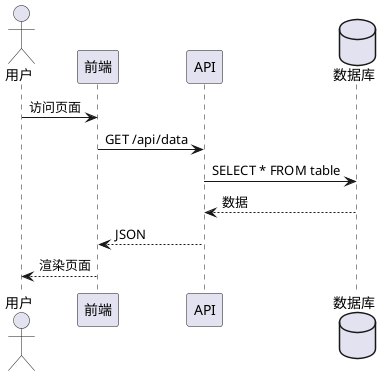
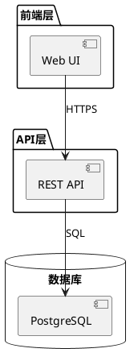
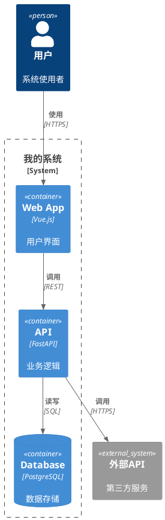

# 架构图替代工具参考手册

## D2（d2lang.com）

### 概述
D2 是声明式图表语言，用 Go 编写，默认样式比 Mermaid 更美观，自动布局更智能。

### 核心语法

```d2
# 基础节点和关系
server: App Server {
  shape: rectangle
}
db: PostgreSQL {
  shape: cylinder
}
server -> db: SQL queries

# 嵌套（等价于 Mermaid subgraph）
cloud: AWS {
  vpc: VPC {
    server: EC2
    db: RDS
    server -> db
  }
}

# 样式
server.style: {
  fill: "#f6f9fe"
  stroke: "#3285c2"
  border-radius: 8
}
```

### 布局引擎
| 引擎 | 特点 | 适用场景 |
|------|------|----------|
| dagre | 默认引擎，快速 | 一般用途 |
| ELK | 更好的节点重叠减少 | 大型图 |
| TALA | 软件架构专用（付费） | 专业架构图 |

### Stack 构造（网格布局）
```d2
grid: {
  rows: 2
  columns: 3
  cell1
  cell2
  cell3
  cell4
  cell5
  cell6
}
```

### 形状库
`rectangle`, `square`, `page`, `parallelogram`, `document`, `cylinder`, `queue`, `package`, `step`, `callout`, `stored_data`, `person`, `diamond`, `oval`, `circle`, `hexagon`, `cloud`, `code`

### vs Mermaid
| 维度 | D2 | Mermaid |
|------|-----|---------|
| 默认美观度 | 更高 | 需手动配置 |
| 自动布局 | 更智能（TALA） | dagre-d3 |
| 生态集成 | 较少 | GitHub/GitLab 原生 |
| 图型丰富度 | 通用图表 | ER/Gantt/Sequence等 |
| 中文支持 | 需配置字体 | Microsoft YaHei 即可 |

### 何时选择 D2
- 需要更美观的默认输出
- 大型复杂架构图需要精确布局控制
- 不需要在 GitHub Markdown 中内嵌渲染

---

## PlantUML

### 概述
Java 生态的图表工具，UML 标准图型最全。需要 JRE 或通过在线服务器渲染。

### 核心语法

**时序图:**


**组件图:**


### C4-PlantUML 扩展

GitHub: `plantuml-stdlib/C4-PlantUML`



### 何时选择 PlantUML
- 团队要求严格 UML 规范
- 需要类图、用例图、活动图等 Mermaid 不支持的 UML 图型
- 已有 Java 开发环境

---

## Structurizr DSL

### 概述
Simon Brown 创建的 C4 模型专用 DSL。核心理念："一个模型，多个视图"。

### 核心语法

```
workspace "我的系统" "系统描述" {

    model {
        user = person "用户" "系统使用者"
        
        system = softwareSystem "我的系统" "核心职责描述" {
            web = container "Web App" "用户界面" "Vue.js"
            api = container "API Service" "业务逻辑" "FastAPI" {
                controller = component "Controller" "处理HTTP请求"
                service = component "Service" "业务逻辑"
                repo = component "Repository" "数据访问"
            }
            db = container "Database" "数据存储" "PostgreSQL"
        }
        
        ext = softwareSystem "外部系统" "第三方服务" {
            tags "External"
        }
        
        # 关系定义
        user -> web "使用" "HTTPS"
        web -> api "调用" "REST/JSON"
        api -> db "读写" "SQL"
        api -> ext "集成" "HTTPS"
    }

    views {
        systemContext system "Context" {
            include *
            autoLayout
        }
        
        container system "Containers" {
            include *
            autoLayout
        }
        
        component api "Components" {
            include *
            autoLayout
        }
        
        styles {
            element "External" {
                background #999999
            }
        }
    }
}
```

### 核心优势
- **一个模型多个视图**: 定义一次模型，自动生成 Context/Container/Component/Deployment 等多个视图
- **隐含关系**: 高层关系自动从低层关系推导，减少重复定义
- **架构决策记录**: 支持在 workspace 中嵌入 ADR

### 渲染方式
- **Structurizr Lite**: 免费本地渲染（Docker）
- **Structurizr Cloud**: 在线协作（付费）
- **导出**: 可导出为 Mermaid、PlantUML、PNG 等格式

### 何时选择 Structurizr
- 大型项目需要从一个模型生成多个C4视图
- 团队需要共享和协作架构模型
- 需要架构决策记录与图表关联

---

## Kroki (kroki.io)

### 概述
统一 HTTP API，支持 20+ 种图表格式的渲染。自托管或使用公共服务。

### 支持的格式
BlockDiag, BPMN, Bytefield, C4 (PlantUML), D2, DBML, Ditaa, ERD, Excalidraw, Graphviz, Mermaid, Nomnoml, Pikchr, PlantUML, Structurizr, SVGBob, TikZ, UMLet, Vega, WaveDrom, WireViz...

### 使用方式

**GET 请求**（diagram 编码在 URL 中）:
```
https://kroki.io/mermaid/svg/eNpLL0osyMnMS1dIyy9KSQEAHxkFNA==
```

**POST 请求**:
```bash
curl -X POST https://kroki.io/ \
  -H "Content-Type: application/json" \
  -d '{
    "diagram_source": "graph TB\n  A-->B",
    "diagram_type": "mermaid",
    "output_format": "svg"
  }'
```

### 自托管
```bash
docker run -d -p 8000:8000 yuzutech/kroki
```

### 何时选择 Kroki
- 需要在一个项目中混用多种图表格式
- 需要统一的渲染服务（CI/CD集成）
- 需要从代码自动生成多种格式的图表

---

## Python diagrams (diagrams.mingrammer.com)

### 概述
Python 库，专门用于云基础设施可视化。提供 AWS/GCP/Azure/Kubernetes 等云服务的官方图标。

### 安装
```bash
pip install diagrams
# 依赖 Graphviz
brew install graphviz  # macOS
apt install graphviz   # Linux
```

### 核心语法

```python
from diagrams import Diagram, Cluster
from diagrams.aws.compute import EC2
from diagrams.aws.database import RDS, ElastiCache
from diagrams.aws.network import ELB

with Diagram("Web Service", show=False):
    lb = ELB("负载均衡")
    
    with Cluster("应用层"):
        svc_group = [EC2("web1"), EC2("web2"), EC2("web3")]
    
    with Cluster("数据层"):
        db = RDS("PostgreSQL")
        cache = ElastiCache("Redis")
    
    lb >> svc_group >> db
    svc_group >> cache
```

### 支持的 Provider
| Provider | 图标数量 | 典型组件 |
|----------|---------|----------|
| AWS | 200+ | EC2, RDS, S3, Lambda, API Gateway |
| GCP | 150+ | Compute Engine, Cloud SQL, Cloud Run |
| Azure | 150+ | VM, SQL Database, Functions |
| Kubernetes | 50+ | Pod, Service, Deployment, Ingress |
| 通用 | 30+ | Client, Server, Database, Firewall |

### 何时选择 Python diagrams
- 需要 AWS/GCP/Azure 官方图标的云架构图
- 希望用 Python 代码生成可重复的架构图
- 需要在 CI/CD 中自动更新架构图

---

## 选择决策矩阵

| 需求 | 首选 | 备选 |
|------|------|------|
| 快速画图，内嵌文档 | **Mermaid** | D2 |
| 美观的架构图 | **D2** | Mermaid + 自定义样式 |
| 严格 UML 规范 | **PlantUML** | Mermaid |
| C4 模型大型项目 | **Structurizr** | C4-PlantUML |
| 多格式统一渲染 | **Kroki** | — |
| 云架构（AWS/GCP） | **Python diagrams** | D2 |
| GitHub 原生渲染 | **Mermaid** | — |
| 中文支持最优 | **Mermaid** (Microsoft YaHei) | PlantUML |
| 零依赖快速上手 | **Mermaid** | D2 |
| 团队协作共享 | **Structurizr Cloud** | Mermaid + Git |

**默认建议**: 除非有特殊需求，**Mermaid 是最安全的选择** — 零依赖、GitHub原生支持、中文友好、图型丰富。
