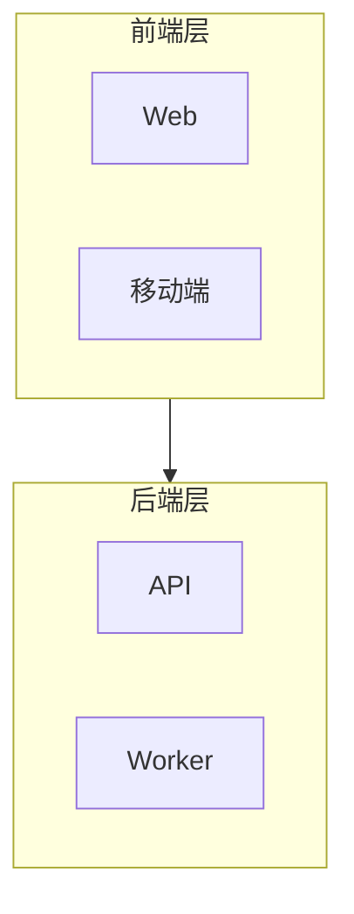
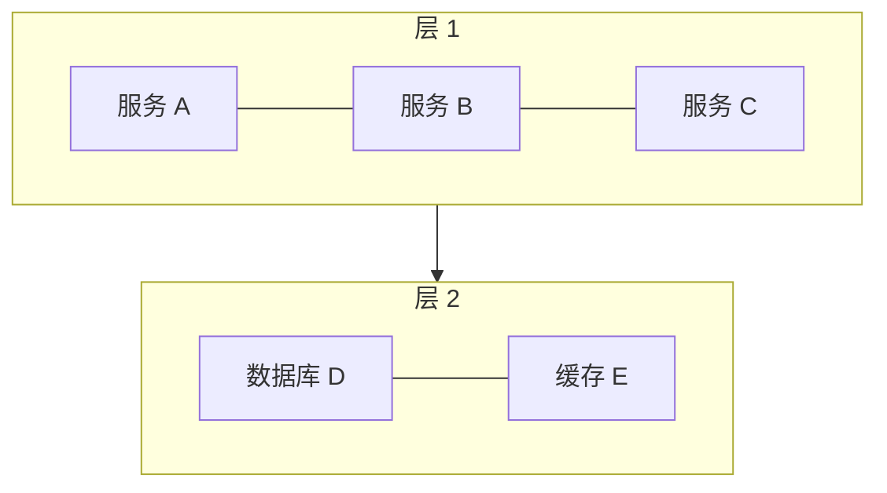
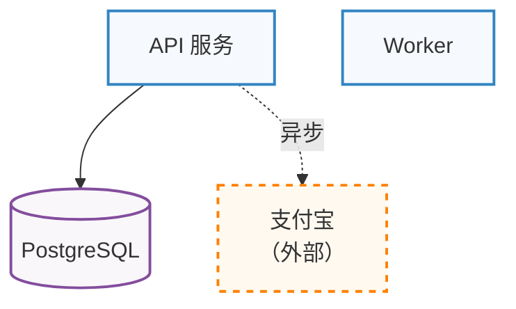
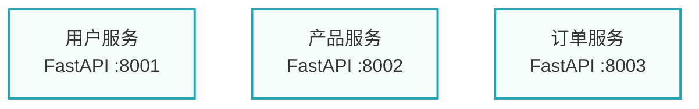
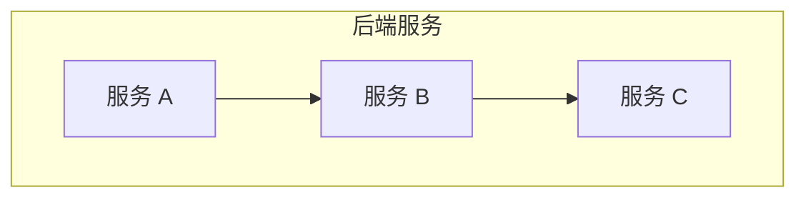
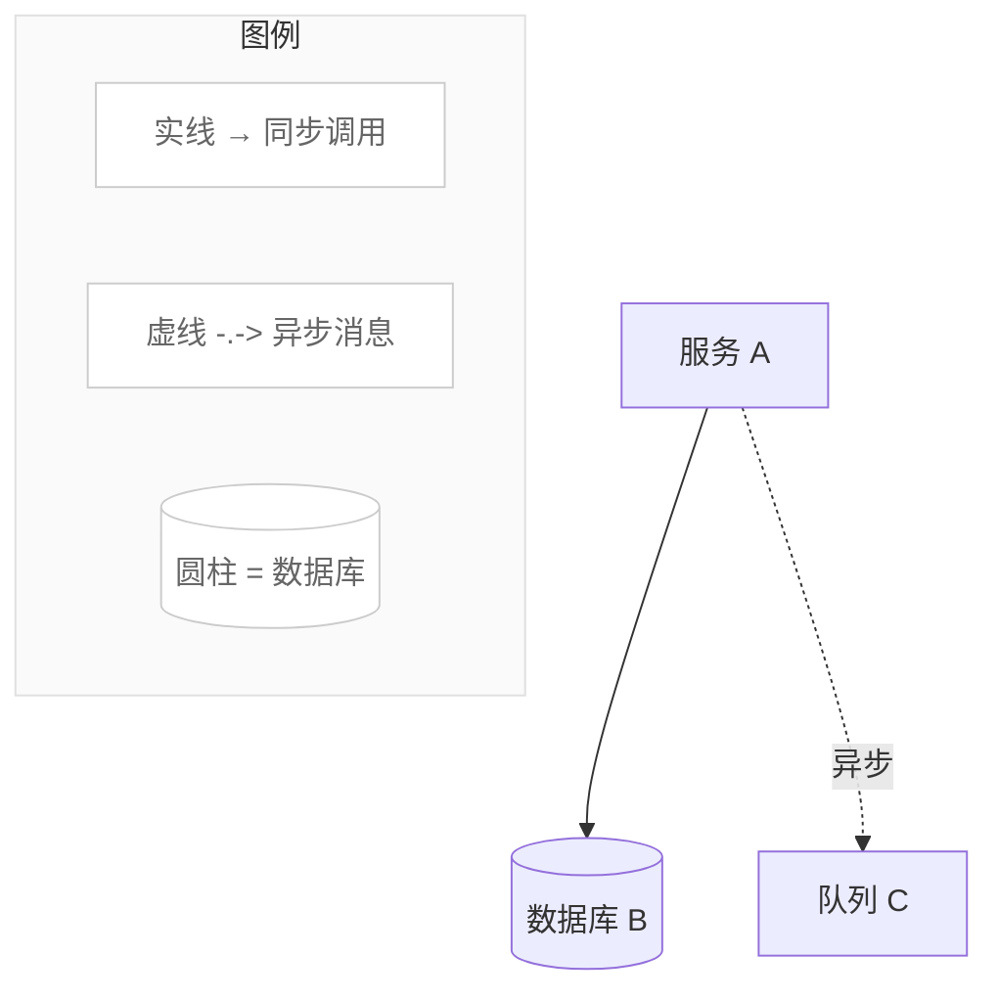

# 架构图设计原则参考手册

## PACR 四原则详解

PACR 是平面设计基本原则在架构图领域的应用：Proximity（亲密性）、Alignment（对齐）、Contrast（对比）、Repetition（重复）。

---

### P — Proximity（亲密性）

**定义**
相关的元素应该在视觉上靠近，不相关的元素应该有明显间距。读者通过元素之间的物理距离判断它们的逻辑关系。

**架构图中的含义**
同一层或同一功能域的组件应该被分组（subgraph），不同层之间应该有足够的视觉间距。

**Mermaid 实现技术**


使用 subgraph 而不是让所有节点漂浮在同一层级。

**好的示例**
- 数据库组件全部放在"数据层" subgraph 内
- AI Agent 组件全部放在"编排层" subgraph 内
- 每层之间有明显的视觉间距

**坏的示例**
- 所有组件平铺，没有分组，读者无法判断哪些是一组的
- 前端组件和数据库混在同一层级

**常见违规**
- subgraph 内部元素太少（只有 1 个），起不到分组效果
- subgraph 太多导致嵌套过深（超过 3 层）
- 相关组件之间没有空白，全部挤在一起

---

### A — Alignment（对齐）

**定义**
元素应该沿着隐形的网格线对齐。即使没有明显的线，眼睛也会寻找对齐关系，不对齐会产生"随意感"和视觉噪音。

**架构图中的含义**
同一层的节点应该等高、等宽；同一列的节点应该左边界对齐。

**Mermaid 实现技术**


在 subgraph 内使用 `direction LR` 让同层节点水平排列。

**好的示例**
- 分层图中每层内的节点水平对齐
- 左右对称的负载均衡架构（左右两组服务等高）

**坏的示例**
- 有的层有 5 个节点，有的层有 1 个节点，高度差异很大
- 相邻层的节点数量差异导致图形看起来不平衡

**常见违规**
- 混用 `graph TB` 和 `graph LR` 的子结构导致方向不一致
- 节点标签长度差异过大，导致节点宽度不一致

---

### C — Contrast（对比）

**定义**
不同类型的元素应该有明显的视觉区别，相同类型的元素应该看起来相同。对比帮助读者快速识别"这是什么类型的组件"。

**架构图中的含义**
- 数据库用圆柱形节点，服务用方形节点
- 不同技术层用不同背景颜色
- 关键路径用粗线，次要依赖用虚线

**Mermaid 实现技术**


**好的示例**
- 数据库节点与服务节点形状不同（圆柱 vs 方形）
- 内部组件与外部依赖颜色不同
- 同步调用用实线，异步调用用虚线

**坏的示例**
- 所有节点都是默认方形，读者无法区分服务、数据库、队列
- 所有连接线都一样，重要路径和次要路径没有区别

**常见违规**
- 颜色太多（超过 5 种主色），产生视觉混乱
- 颜色差异太小，人眼无法区分
- 重要路径和不重要路径用相同粗细的线

---

### R — Repetition（重复）

**定义**
视觉元素（颜色、形状、字体大小）应该在整张图中保持一致。重复创造统一感，让图看起来"专业"而非"随意拼凑"。

**架构图中的含义**
- 同类组件（所有 API 服务）使用相同的 classDef
- 同类连接（所有数据库连接）使用相同的线型
- 所有节点标签使用相同的格式（如"名称 + 换行 + 技术栈"）

**Mermaid 实现技术**


**好的示例**
- 所有微服务节点标签格式一致：`服务名\n技术栈 :端口`
- 所有数据库节点使用相同颜色
- 图中每层使用的 classDef 前后一致

**坏的示例**
- 部分节点有端口号，部分没有
- 同是数据库，部分用 `[(name)]`，部分用 `[name]`
- 不同页面/不同图的同一组件用了不同颜色

**常见违规**
- 随意给某个节点加粗或改色，破坏一致性
- 部分节点有详细说明，部分只有名称

---

## 色彩理论

### 语义化色彩映射

架构图中的颜色应该传达含义，而不仅是装饰。推荐的六层语义色板：

| 层次 | 含义 | fill | stroke | 适用节点 |
|------|------|------|--------|---------|
| 前端/UI | 用户可见界面 | `#f6f9fe` | `#3285c2` | Web 应用、移动端、管理后台 |
| API/网关 | 接口入口 | `#f5fefd` | `#23a5b4` | API 网关、BFF、负载均衡 |
| 业务编排 | 核心业务逻辑 | `#fffbf5` | `#ff8000` | 业务服务、AI Agent、工作流 |
| 计算引擎 | 算法与计算 | `#f9f7fa` | `#834d9d` | ML 模型、数据处理、规则引擎 |
| 数据/持久化 | 存储与持久化 | `#f8faf9` | `#699261` | 数据库、缓存、对象存储 |
| 未就绪/告警 | 计划中或有问题 | `#fef5f6` | `#c80705` | 待开发组件、故障节点 |

### Mermaid classDef 色板定义

```mermaid
graph TB
    classDef frontend  fill:#f6f9fe,stroke:#3285c2,stroke-width:2px,color:#1a1a2e
    classDef api       fill:#f5fefd,stroke:#23a5b4,stroke-width:2px,color:#1a1a2e
    classDef biz       fill:#fffbf5,stroke:#ff8000,stroke-width:2px,color:#1a1a2e
    classDef engine    fill:#f9f7fa,stroke:#834d9d,stroke-width:2px,color:#1a1a2e
    classDef data      fill:#f8faf9,stroke:#699261,stroke-width:2px,color:#1a1a2e
    classDef alert     fill:#fef5f6,stroke:#c80705,stroke-width:2px,stroke-dasharray:5
```

### 颜色使用规则

**主色数量**：每张图最多使用 3 种主要颜色，超过 5 种会导致视觉混乱。

**亮度原则**：背景色应该非常浅（接近白色），描边色应该饱和度高。这样节点在白色背景上清晰可辨，又不会过于鲜艳。

**背景填充**：使用极浅的颜色（如 `#f6f9fe`）而不是白色（`#ffffff`），白色填充与白色背景无法区分节点边界。

**外部系统**：外部依赖（第三方系统、SaaS 服务）使用虚线描边（`stroke-dasharray:5`）和浅色，与内部系统形成对比。

### 色盲友好性

约 8% 的男性有红绿色盲，架构图应该做到"颜色不是唯一区分手段"：

**策略 1：形状 + 颜色双重编码**
```
服务 → 方形节点 + 蓝色
数据库 → 圆柱节点 + 绿色
外部系统 → 圆角矩形 + 橙色虚线
```

**策略 2：标签补充**
在节点标签中注明类型：`PostgreSQL（数据库）` 而不只是节点颜色传达"这是数据库"。

**策略 3：避免只用红/绿区分**
用"虚线 + 灰色"表示"计划中"，而不是"绿色 = 已完成，红色 = 未完成"。

---

## 中英混排排版

### 语言分工原则

**使用英文**：
- 端口号（`:5432`、`:8000`、`:443`）
- 技术术语（`REST`、`gRPC`、`WebSocket`、`JWT`）
- 协议名称（`HTTP/2`、`AMQP`、`TCP`）
- 产品名称（`PostgreSQL`、`Redis`、`Kubernetes`、`Vue`）
- 版本号（`v3.2`、`16.0`）

**使用中文**：
- 层次名称（"前端层"、"业务层"、"数据层"）
- 业务概念（"用户管理"、"保险推荐"、"风险评估"）
- 关系说明（"调用"、"读写"、"异步通知"）
- 备注和描述

**混排示例**：
```
A["用户服务<br/>FastAPI :8001"]
B["AI 推荐引擎<br/>LangChain + GPT-4"]
C[("主数据库<br/>PostgreSQL 16 :5432")]
```

### 字体推荐

- **首选**：`Microsoft YaHei, PingFang SC, Arial, sans-serif`
- **原因**：Microsoft YaHei 在 Windows 渲染清晰；PingFang SC 在 macOS 渲染清晰；Arial 作为无中文字体环境的回退

### 标签换行规范

- **每行中文上限**：12 个汉字（约 25 字符宽度）
- **每行英文上限**：25 个字符
- **换行语法**：`<br/>` 或 `<br>`（两者均支持）
- **层次结构**：第一行写中文名称，第二行写技术栈/版本/端口

---

## 布局原则

### 空白（Whitespace）

空白是设计的一部分，不是"浪费空间"。充足的空白让图形可读性提升 40%。

**实践**：
- subgraph 之间保持足够间距（让 Mermaid 自动计算，避免强制塞入太多节点）
- 单个 subgraph 内不超过 6-7 个节点
- 节点标签不要写得过于简短（"DB"比"PostgreSQL 16"信息密度差 10 倍）

### 流向方向

- **从上到下（TB）**：适合展示层次结构（请求从用户流向数据库）
- **从左到右（LR）**：适合展示流程（数据流水线、ETL 管道）
- **混用**：主图用 TB，在 subgraph 内用 `direction LR` 让同层节点水平排列



### 视觉重量

- **更大的节点**吸引注意力 → 核心系统应该标签更丰富（名称 + 技术栈 + 端口）
- **更深的颜色**吸引注意力 → 关键路径用实线，次要路径用虚线
- **更粗的线条**吸引注意力 → 主数据流用 `==>`，辅助数据流用 `-->`

### 左右对称

分层架构图应该在视觉上左右平衡：

- 如果左侧有 3 个前端服务，右侧也应该有类似数量的节点
- 避免一侧非常拥挤，另一侧几乎空白
- 可以用不可见连接线 `~~~` 调整节点位置

---

## 架构反模式图解

### 大泥球（Big Ball of Mud）

**定义**：系统没有清晰的层次，所有组件互相依赖，没有明确的边界。

**视觉症状**：
- 连接线从每个节点出发，指向几乎所有其他节点
- 无法划分出有意义的 subgraph
- 图看起来像蜘蛛网，中央密集，无规律

**诊断方法**：如果你的架构图需要超过 20 条连接线才能表达清楚，很可能是大泥球。

**应对**：识别出稳定的抽象层（接口/API），在图中明确绘制层间边界。

---

### 金锤子（Golden Hammer）

**定义**：用同一种技术解决所有问题，不论是否合适。

**视觉症状**：
- 图中一个技术/组件出现在每一层
- 例如：所有数据都走 Redis，无论是否需要持久化
- 例如：所有服务通信都用同步 REST，没有任何异步

**诊断方法**：检查是否有某个节点或技术名称出现频率远高于其他节点。

**应对**：在图中明确标注每种技术的用途，如果两个"Redis"节点的用途不同（缓存 vs 消息队列），用不同颜色或标签区分。

---

### 过度工程（Over-engineering）

**定义**：为未来的需求添加过多抽象层，使简单问题复杂化。

**视觉症状**：
- 图中层级超过 6 层，但每层只有 1-2 个组件
- 存在只用于"转发"的中间层，没有任何业务逻辑
- 连接线数量远多于节点数量

**诊断方法**：移除某个节点后，系统是否仍然能完成相同功能？如果是，这个节点可能是过度工程。

**应对**：每次加入新层之前，问"这一层解决了什么问题，不加会怎样"。

---

### 集成数据库（Integration Database）

**定义**：多个服务共用一个数据库，通过数据库实现服务间通信。

**视觉症状**：
- 多条连接线从不同的服务汇聚到同一个数据库节点
- 数据库节点是图的"交汇中心"
- 服务之间没有 API 调用，只有数据库调用

**诊断方法**：如果有 3 个以上的服务指向同一个数据库节点，检查是否有服务在读另一个服务的表。

**应对**：明确标注哪些服务"拥有"哪些数据库（用 subgraph 包含），只有数据的所有者才能直接访问。

---

## 同构测试操作指南

同构测试验证架构图的**视觉结构**是否传达了正确的**逻辑结构**。

### 操作步骤

**Step 1**：用白纸或手遮住图中所有文字标签（节点名称、连接线标签）。

**Step 2**：观察剩余的视觉结构，问自己：
- 我能看出几个层次？
- 我能看出哪些组件是一组的？
- 我能看出请求的流向（从哪里到哪里）？
- 图中有清晰的主路径吗？

**Step 3**：如果你对上述任何一个问题无法回答"是"，图的结构需要改进。

### 常见修复方案

| 问题 | 修复 |
|------|------|
| 看不出层次 | 增加 subgraph 分层，调整为 TB 方向 |
| 看不出分组 | 将相关节点移入同一 subgraph |
| 看不出流向 | 调整节点位置，让箭头方向一致（尽量从上到下或从左到右） |
| 没有主路径 | 关键路径改用粗线（`==>`），次要路径改用虚线（`-.->` ）|

---

## 教育测试操作指南

教育测试验证架构图是否提供了**足够的信息密度**，让读者学到真实知识。

### 操作步骤

**Step 1**：逐个读取图中每个节点的标签。

**Step 2**：对每个标签问：
- 这个标签告诉了我一个具体的事实吗？
- 如果我是新人，读完这个标签后，我知道这个组件用什么技术、监听什么端口、承担什么职责吗？

**Step 3**：对于只有通用名称的标签，用更具体的信息替换。

### 替换示例

| 低信息密度（坏）| 高信息密度（好）|
|----------------|----------------|
| `数据库` | `PostgreSQL 16 :5432` |
| `缓存` | `Redis 7 :6379（会话 + 热点）` |
| `消息队列` | `Kafka 3.5 :9092（订单事件）` |
| `API` | `FastAPI :8000（REST + JWT 认证）` |
| `前端` | `Vue 3 + TypeScript（SPA）` |
| `AI 服务` | `LangChain + GPT-4（Agent 编排）` |

**目标**：一张好的架构图应该能让新入职的工程师在 5 分钟内理解系统的技术选型全貌。

---

## 图例约定

### 内联图例

在 Mermaid 图的底部添加图例节点：



### 标准图例约定

**连接线类型**：
- 实线 `-->` = 同步强依赖（调用方等待响应）
- 虚线 `-.->` = 异步弱依赖（发即忘或最终一致）
- 粗线 `==>` = 主路径/关键路径
- 不可见线 `~~~` = 仅用于布局控制，不表达任何关系

**节点形状**：
- 方形 `[name]` = 服务、应用、模块
- 圆柱形 `[(name)]` = 数据库、存储
- 圆角矩形 `(name)` = 流程步骤、任务
- 菱形 `{name}` = 决策、条件分支
- 圆形 `((name))` = 事件、连接点

**边框样式**：
- 实线边框 = 内部组件（本系统内）
- 虚线边框（`stroke-dasharray:5`）= 外部依赖（第三方服务、SaaS）
- 红色边框 = 告警、待开发、故障节点

### 图例放置位置

图例放置在图的右下角或底部，使用 subgraph 包裹并降低视觉权重（浅灰色背景、细灰色描边）。图例不应该比主要内容更显眼。
