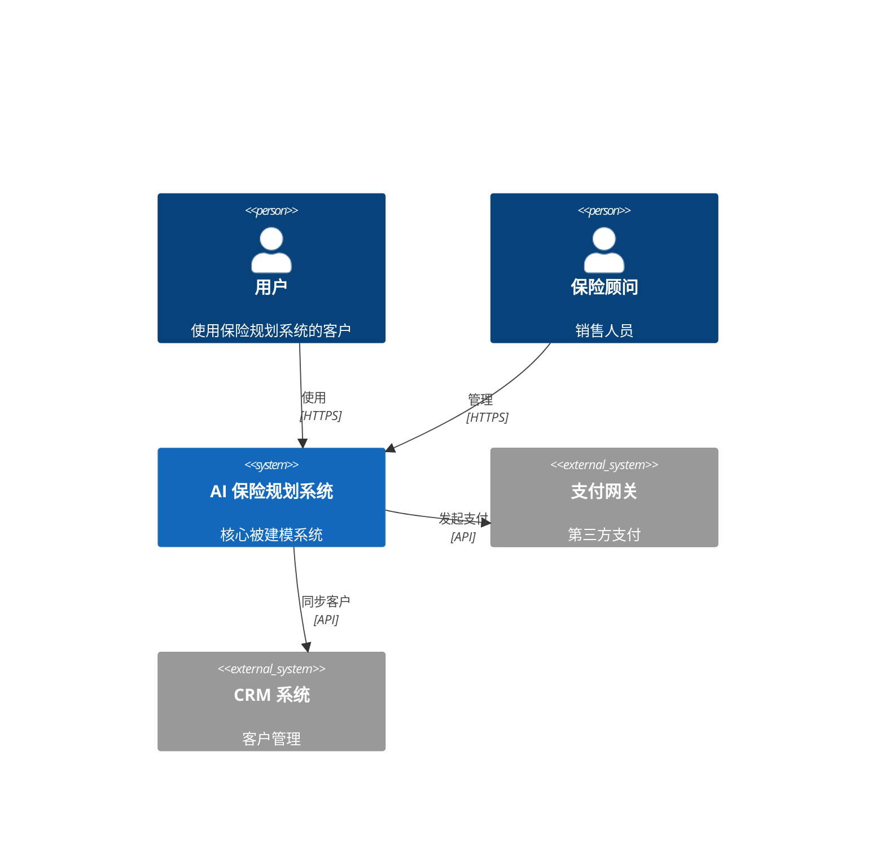
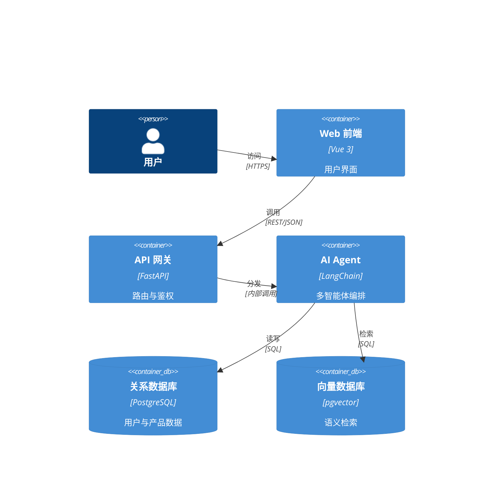
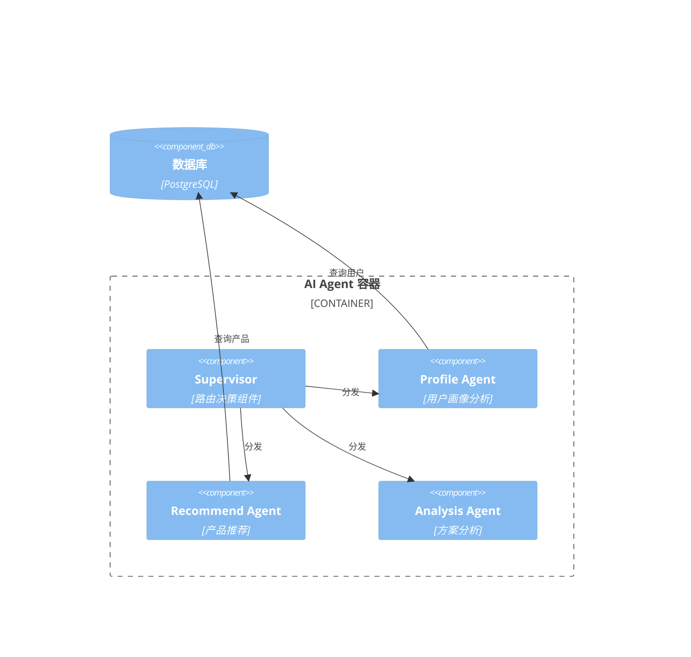

# 架构图类型参考手册

## C4 模型 (Simon Brown)

C4 模型是一种用于可视化软件架构的分层抽象方法，名称来自四个层级：Context（上下文）、Container（容器）、Component（组件）、Code（代码）。

### Level 1: System Context（系统上下文图）

**定义**
展示系统与外部世界的关系。聚焦"这个系统是什么，谁在使用它，它依赖哪些外部系统"。

**元素**
- Person：使用系统的用户或角色
- Software System：被建模的系统本身（高亮显示）
- External System：外部依赖的第三方系统

**适用场景**
- 项目启动时与所有干系人建立共识
- 需求分析阶段确认系统边界
- 向非技术人员解释系统定位

**不适用场景**
- 展示内部技术选型
- 讨论部署细节
- 代码评审

**Mermaid 示例**


---

### Level 2: Container（容器图）

**定义**
展示系统内部的高层技术构建块——每个"容器"是一个可独立部署的单元（Web 应用、移动端、数据库、微服务等）。

**元素**
- Container：可独立运行/部署的进程（标注技术栈）
- ContainerDb：数据存储容器
- Container_Ext：外部系统的容器
- Person：同 Context 层的用户角色

**适用场景**
- 技术选型讨论
- 团队分工划分（一个容器对应一个团队）
- DevOps 管道设计
- 新成员技术入职

**不适用场景**
- 展示内部代码结构
- 讨论单个函数或类

**Mermaid 示例**


---

### Level 3: Component（组件图）

**定义**
展示单个容器内部的组件结构——组件是一组相关功能的集合（通常对应代码模块或服务类）。

**元素**
- Component：单个容器内的功能模块
- ComponentDb：组件级别的数据存储

**适用场景**
- 技术负责人向开发团队讲解模块分工
- 代码评审前的结构说明
- 识别耦合过重的组件

**不适用场景**
- 向业务人员展示
- 展示整个系统（粒度过细）

**Mermaid 示例**


---

### Level 4: Code（代码图）

**定义**
展示单个组件内部的类、接口、函数关系，通常对应 UML 类图。

**元素**
- 类（Class）
- 接口（Interface）
- 继承/实现关系

**适用场景**
- 框架或核心算法的设计文档
- 代码评审
- 生成 API 文档

**不适用场景**
- 绝大多数沟通场景（粒度太细、维护成本高）
- 敏捷团队（代码即文档）
- 系统说明

---

### C4 决策指南

**黄金法则**：从 Context 开始，只在需要时向下深入。

```
Context + Container = 覆盖 90% 的沟通需求
Component = 供技术团队内部使用
Code = 几乎不需要（现代 IDE 和代码本身承担此职责）
```

**决策路径**
1. 和谁沟通？
   - 业务/管理层 → 只需 Context
   - 技术决策者 → Context + Container
   - 开发团队 → Container + Component（按需）
   - 代码评审 → Component + Code（罕见）

2. 多少层合适？
   - 一张 Context 图 + 一张 Container 图 = 标准交付物
   - 超过 3 层需要有充分理由

---

## 4+1 视图框架

Philippe Kruchten 于 1995 年提出，用五个视图从不同角度描述软件架构。

### Logical View（逻辑视图）

**关注点**：功能需求、系统提供哪些功能、组件之间的关系
**受众**：最终用户、业务分析师
**常用图型**：类图、对象图、状态图
**核心问题**：系统能做什么？

### Physical View（物理视图）

**关注点**：软硬件部署拓扑，组件如何映射到物理节点
**受众**：系统工程师、运维人员
**常用图型**：部署图、网络拓扑图
**核心问题**：系统运行在哪里？

### Process View（进程视图）

**关注点**：运行时的进程、线程、组件间通信、数据流时序
**受众**：系统集成工程师、性能工程师
**常用图型**：时序图、活动图、数据流图
**核心问题**：系统如何运行？

### Development View（开发视图）

**关注点**：软件模块组织、包结构、代码仓库划分
**受众**：开发人员、架构师
**常用图型**：包图、组件图、模块依赖图
**核心问题**：系统如何构建？

### Scenario View（场景视图，+1）

**关注点**：具体用例，将以上四个视图串联起来
**受众**：所有干系人
**常用图型**：用例图、时序图
**核心问题**：系统如何响应关键场景？

---

### 4+1 与图型映射

| 视图 | C4 对应 | 传统图型 |
|------|---------|---------|
| 逻辑视图 | C4 Component | 功能架构、类图 |
| 物理视图 | C4 Container | 部署架构、网络拓扑 |
| 进程视图 | — | 时序图、数据流图 |
| 开发视图 | C4 Component | 代码架构、包图 |
| 场景视图 | C4 Context | 用例图、时序图 |

---

## 7 种传统架构图

### 1. 系统总览架构（System Overview）

**定义**
以系统为中心，展示主要子系统/模块及其关系，不涉及具体技术实现。

**适用受众**
CTO、产品经理、业务领导、新入职技术人员

**典型内容**
- 主要功能模块（用方块表示）
- 模块间数据流向（用箭头表示）
- 外部系统依赖
- 不涉及具体技术栈

**Mermaid 图型**
`graph TB` 或 `graph LR`

**使用时机**
- 项目立项 PPT
- 技术方案概述
- 跨团队技术对齐

---

### 2. 应用架构（Application Architecture）

**定义**
展示应用层面的分层结构（前端/中台/后端/数据层），以及层间调用关系和主要技术组件。

**适用受众**
研发团队、架构师、技术评审委员会

**典型内容**
- 分层结构（表现层、业务层、数据层等）
- 每层主要组件及技术栈标注
- 层间接口（REST、RPC、消息队列等）
- 横切关注点（认证、日志、监控）

**Mermaid 图型**
`graph TB` 配合 `subgraph` 分层

**使用时机**
- 技术方案评审
- 新系统设计阶段
- 技术债务梳理

---

### 3. 技术架构（Technical Architecture）

**定义**
展示技术选型全貌——选用了哪些框架、中间件、基础设施，以及它们如何配合工作。

**适用受众**
架构师、高级工程师、技术负责人

**典型内容**
- 具体技术产品（如 Redis 7、Kafka 3.5、Kubernetes 1.29）
- 版本信息
- 网络协议（HTTP/2、gRPC、AMQP）
- 端口号
- 基础设施选型（云厂商、容器平台）

**Mermaid 图型**
`graph TB` 或 `C4Container`

**使用时机**
- 技术选型决策会议
- 安全审计准备
- 性能优化分析

---

### 4. 数据架构（Data Architecture）

**定义**
展示数据的存储结构、流转路径、治理策略，包括实体关系和数据流。

**适用受众**
数据工程师、DBA、数据分析师、合规人员

**典型内容**
- 实体关系（ER 图）
- 数据流向（ETL/ELT 管道）
- 数据存储类型（OLTP、OLAP、对象存储）
- 数据分类（原始数据、加工数据、指标数据）

**Mermaid 图型**
`erDiagram`（结构）+ `graph LR`（流转）

**使用时机**
- 数据库设计阶段
- 数据治理规划
- GDPR/数据合规审查

---

### 5. 部署架构（Deployment Architecture）

**定义**
展示软件组件如何部署在物理或虚拟基础设施上，包括网络拓扑、资源配置。

**适用受众**
DevOps 工程师、SRE、运维团队、安全审计

**典型内容**
- 服务器/容器/Pod 配置
- 网络区域（公网、内网、DMZ）
- 负载均衡器、防火墙
- 云资源（VPC、子网、安全组）
- 资源规格（CPU、内存）

**Mermaid 图型**
`graph TB` 配合 subgraph 表示网络区域

**使用时机**
- 上线前架构评审
- 容量规划
- 故障演练准备
- 成本分析

---

### 6. 功能架构（Functional Architecture）

**定义**
从业务功能视角组织系统，展示功能模块的分组、层级和关系，不涉及技术实现。

**适用受众**
产品经理、业务分析师、项目经理

**典型内容**
- 功能域划分（如"用户管理"、"订单管理"）
- 功能模块树状结构
- 功能依赖关系
- 核心业务流程路径

**Mermaid 图型**
`graph TB` 树状结构，或 `mindmap`

**使用时机**
- 产品需求梳理
- 功能边界划分
- 业务模块优先级排期

---

### 7. 代码架构（Code Architecture）

**定义**
展示代码的组织方式——包结构、模块依赖、类层次关系。

**适用受众**
开发人员、代码审查者

**典型内容**
- 包/模块结构
- 类继承和接口实现
- 模块间依赖方向
- 设计模式应用（工厂、策略、观察者等）

**Mermaid 图型**
`classDiagram`

**使用时机**
- 核心框架设计文档
- 重构方案设计
- 代码评审辅助说明

---

## 图型选择决策流程

```
需要画一张架构图？
│
├─ 展示系统外部关系（谁用它、它依赖谁）？
│   └─ → C4 Context 图
│
├─ 展示系统内部技术选型（用了什么技术）？
│   └─ → C4 Container 图 / 系统总览架构
│
├─ 展示接口交互（谁先调谁、请求/响应格式）？
│   └─ → 时序图（sequenceDiagram）
│
├─ 展示状态流转（对象的生命周期）？
│   └─ → 状态图（stateDiagram-v2）
│
├─ 展示数据结构（表、字段、关系）？
│   └─ → ER 图（erDiagram）
│
├─ 展示部署拓扑（服务器、网络、云资源）？
│   └─ → 部署架构（graph TB + subgraph）
│
├─ 展示项目进度（里程碑、任务排期）？
│   └─ → 甘特图（gantt）
│
└─ 以上都不是 → 重新思考需求，使用功能架构或应用架构
```

**辅助判断问题**
- 受众是技术人员还是业务人员？技术 → C4 Container；业务 → 功能架构
- 需要精确程度高还是概念清晰？精确 → 技术架构；概念 → 系统总览
- 是静态结构还是动态行为？静态 → C4/ER；动态 → 时序图/状态图

---

## 多图组合策略

良好的架构文档往往是多张图的组合，每张图聚焦一个关切点。

### 组合 1：C4 Context + Sequence（边界 + 交互）

**适用**：向技术评审展示新功能设计

**策略**：
1. 先用 C4 Context 建立系统边界共识
2. 再用 Sequence 图展示关键用例的交互细节
3. Context 中的系统/用户节点与 Sequence 的参与者保持一致命名

**效果**：读者先理解"谁在哪里"，再理解"谁对谁做了什么"。

---

### 组合 2：System Overview + Deployment（逻辑 + 物理）

**适用**：上线评审、运维交接

**策略**：
1. System Overview 展示逻辑模块划分（5-8 个模块）
2. Deployment 图展示这些模块如何映射到物理/云资源
3. 两张图使用一致的模块名称，便于对照

**效果**：让审查者理解"逻辑上是什么"与"物理上在哪里"的对应关系。

---

### 组合 3：ER + Sequence（数据结构 + 数据流）

**适用**：数据库设计评审、API 设计

**策略**：
1. ER 图展示实体关系和字段定义
2. Sequence 图展示业务流程中数据如何被创建、读取、修改
3. ER 中的实体名称与 Sequence 的对象名称保持一致

**效果**：既能理解数据模型，又能理解数据的动态流转路径。

---

### 组合 4：C4 全层级（仅限大型项目）

**适用**：系统架构设计文档（正式）

**策略**：
1. Level 1 Context：1 张
2. Level 2 Container：1 张（整体）
3. Level 3 Component：每个关键容器 1 张（按需）
4. 不需要 Level 4（Code）

**效果**：提供"地图式"导航，读者可根据需要选择粒度。

---

### 组合原则

- **一致性**：多张图中同一实体用相同名称
- **单一关切**：每张图只回答一个问题
- **递进深入**：从全局到局部，由外到内
- **克制数量**：3-5 张图通常足够，超过 10 张需要重新组织
