# Mermaid 语法完整参考手册

## 初始化配置（init block）

### 基本结构
```
%%{init: {'theme': 'base', 'themeVariables': {'fontSize': '20px', 'fontFamily': 'Microsoft YaHei, Arial'}}}%%
```

### 主题选项

| 主题名 | 特点 | 适用场景 |
|--------|------|---------|
| `base` | 极简白底，最可定制 | 自定义配色时首选 |
| `default` | 蓝色调默认主题 | 通用场景 |
| `dark` | 深色背景 | 暗色文档、演示 |
| `forest` | 绿色调自然风格 | 非正式场景 |
| `neutral` | 灰度无色彩 | 打印文档 |

### themeVariables 可配置项

```
%%{init: {
  'theme': 'base',
  'themeVariables': {
    'primaryColor': '#f6f9fe',
    'primaryTextColor': '#1a1a2e',
    'primaryBorderColor': '#3285c2',
    'lineColor': '#666666',
    'secondaryColor': '#f5fefd',
    'tertiaryColor': '#fffbf5',
    'background': '#ffffff',
    'mainBkg': '#f6f9fe',
    'nodeBorder': '#3285c2',
    'clusterBkg': '#fafafa',
    'titleColor': '#1a1a2e',
    'edgeLabelBackground': '#ffffff',
    'fontSize': '16px',
    'fontFamily': 'Microsoft YaHei, Arial, sans-serif'
  }
}}%%
```

### ELK 布局引擎

ELK（Eclipse Layout Kernel）提供更好的自动布局，适合复杂图形：

```
%%{init: {'flowchart': {'defaultRenderer': 'elk'}}}%%
graph TB
    A --> B
    A --> C
    B --> D
    C --> D
```

ELK 适用于：节点超过 15 个、存在大量交叉连线、需要更均匀的层级分布。

---

## graph / flowchart 完整语法

### 方向声明

```
graph TB    % Top to Bottom（从上到下，最常用）
graph BT    % Bottom to Top
graph LR    % Left to Right（流程图常用）
graph RL    % Right to Left
```

`flowchart` 是 `graph` 的别名，功能相同，推荐用 `flowchart`。

### 节点形状大全

```
graph TB
    A[方形节点]               %% 默认方形，表示普通组件/服务
    B(圆角矩形)               %% 表示过程/步骤
    C([椭圆形/胶囊])          %% 表示开始/结束节点
    D[[子程序形状]]           %% 表示子程序或预定义流程
    E[(圆柱形/数据库)]        %% 表示数据库/存储
    F((圆形))                 %% 表示事件或连接点
    G{菱形/判断}              %% 表示决策/条件判断
    H{{六边形}}               %% 表示准备/条件
    I[/平行四边形/]           %% 表示输入/输出
    J[\反向平行四边形\]       %% 表示输入/输出（变体）
    K[/梯形\]                 %% 表示手工操作
    L[\反梯形/]               %% 表示手工输入
```

### 连接线类型

```
graph LR
    A --> B          %% 实线箭头（强依赖）
    C --- D          %% 实线无箭头（关联）
    E -.-> F         %% 虚线箭头（弱依赖/计划中）
    G -.- H          %% 虚线无箭头（松散关联）
    I ==> J          %% 粗实线箭头（强调/主路径）
    K === L          %% 粗实线无箭头
    M ~~~ N          %% 不可见连接（仅用于控制布局）
    O --o P          %% 圆形终点
    Q --x R          %% 叉形终点（表示终止）
    S o--o T         %% 双向圆形
    U <--> V         %% 双向箭头
```

### 连接线标签

```
graph LR
    A -->|"REST/JSON"| B
    C ---|"同步调用"| D
    E -.->|"异步消息"| F
    G -->|"SQL :5432"| H
```

**注意**：标签中有空格时必须用引号包裹。

### 连接线长度控制

```
graph TB
    A --> B       %% 默认长度
    C ---> D      %% 额外一个 - 增加一级长度
    E ----> F     %% 增加两级长度
```

### subgraph 分层嵌套

```
graph TB
    subgraph frontend["前端层"]
        direction TB
        web["Web App<br/>Vue 3"]
        mobile["移动端<br/>React Native"]
    end

    subgraph backend["后端层"]
        direction TB
        api["API 网关<br/>FastAPI"]
        agent["AI Agent<br/>LangChain"]
    end

    subgraph data["数据层"]
        direction TB
        pg[("PostgreSQL<br/>:5432")]
        redis[("Redis<br/>:6379")]
    end

    frontend --> backend
    backend --> data
```

**三层嵌套（最大深度）**
```
graph TB
    subgraph outer["外层"]
        subgraph middle["中层"]
            subgraph inner["内层"]
                node["节点"]
            end
        end
    end
```

### 不可见 subgraph 分组技巧

用于将节点视觉分组但不显示边框：

```
graph TB
    subgraph g1[" "]
        A
        B
    end
    style g1 fill:none,stroke:none
```

---

## sequenceDiagram

### 基本结构

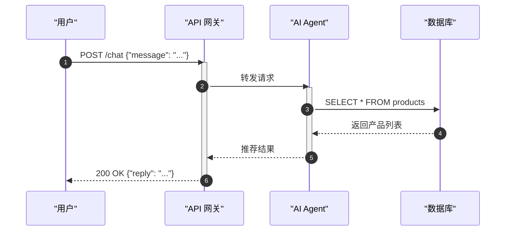

### 参与者声明

```
participant A as "显示名称"    %% 矩形框（服务、系统）
actor B as "用户角色"          %% 人形图标（人类用户）
```

### 箭头类型

```
A ->> B      %% 实线箭头（同步请求）
A -->> B     %% 虚线箭头（响应/返回值）
A -> B       %% 实线无箭头
A --> B      %% 虚线无箭头
A -x B       %% 带叉箭头（表示异步消息，丢弃）
A -) B       %% 带圆箭头（异步）
```

### 激活与停用

```
activate A
A ->> B: 调用
deactivate A

%% 简写形式（+/- 符号）
A ->>+ B: 激活并调用
B -->>- A: 返回并停用
```

### Note 注释

```
Note over A, B: 跨两个参与者的注释
Note left of A: 左侧注释
Note right of B: 右侧注释
```

### 循环和条件块

```
loop 轮询（每 30 秒）
    A ->> B: 心跳检查
    B -->> A: pong
end

alt 用户已登录
    A ->> B: 获取用户数据
else 用户未登录
    A ->> B: 跳转登录页
end

opt 仅在有缓存时
    A ->> Cache: 读取缓存
end
```

### 并行块

```
par 并行调用
    A ->> B: 调用服务 B
and
    A ->> C: 调用服务 C
end
```

### critical 块（错误处理）

```
critical 获取数据库连接
    A ->> DB: 连接
option 超时
    A ->> Log: 记录超时
option 连接被拒
    A ->> Log: 记录拒绝
end
```

### rect 背景高亮

```
rect rgba(50, 133, 194, 0.1)
    Note over A, B: 认证流程
    A ->> B: 发送 Token
    B -->> A: 验证结果
end
```

---

## stateDiagram-v2

### 基本语法

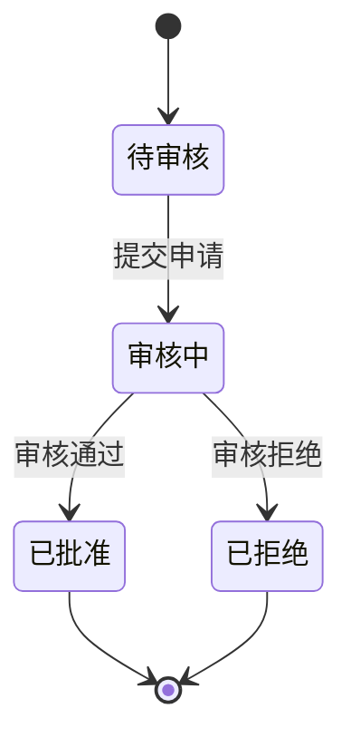

### 复合状态

```
stateDiagram-v2
    state 处理中 {
        [*] --> 解析请求
        解析请求 --> 调用模型
        调用模型 --> 格式化结果
        格式化结果 --> [*]
    }
    [*] --> 处理中
    处理中 --> 完成
```

### 选择节点（Choice）

```
stateDiagram-v2
    state 判断金额 <<choice>>
    [*] --> 判断金额
    判断金额 --> 小额支付 : 金额 < 1000
    判断金额 --> 大额支付 : 金额 >= 1000
```

### 并发状态

```
stateDiagram-v2
    state 订单处理 {
        [*] --> 库存检查
        --
        [*] --> 支付验证
        --
        [*] --> 风控检测
    }
```

### Fork / Join

```
stateDiagram-v2
    state fork_state <<fork>>
    state join_state <<join>>

    [*] --> fork_state
    fork_state --> 任务A
    fork_state --> 任务B
    任务A --> join_state
    任务B --> join_state
    join_state --> [*]
```

### 状态注释

```
stateDiagram-v2
    A --> B
    note right of A
        这里是注释内容
        可以多行
    end note
```

---

## erDiagram

### 关系符号说明

```
||--||    一对一（强制）
||--o|    一对零或一
||--|{    一对多（至少一个）
||--o{    一对零或多
}|--||    多对一（至少一个）
}o--o{    零或多对零或多
```

**符号含义**
- `|` = exactly one（恰好一个）
- `o` = zero or one（零或一）
- `{` = one or more（一或多）

### 完整示例

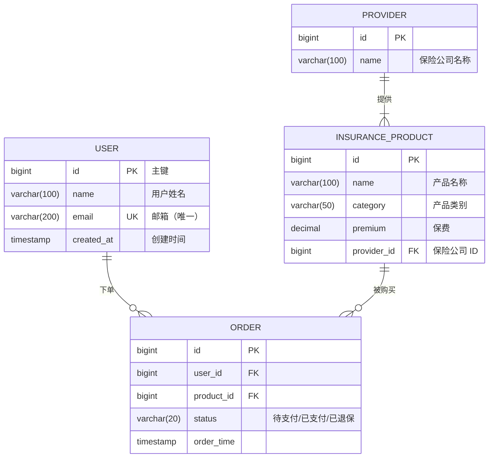

### 字段标记

| 标记 | 含义 |
|------|------|
| PK | Primary Key（主键）|
| FK | Foreign Key（外键）|
| UK | Unique Key（唯一键）|

---

## gantt

### 基本语法

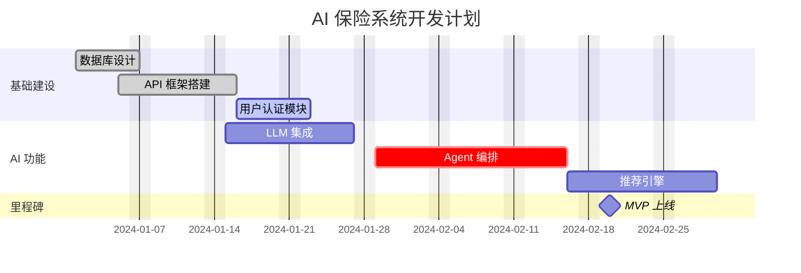

### 任务状态

| 关键字 | 含义 | 视觉效果 |
|--------|------|---------|
| `done` | 已完成 | 深色填充 |
| `active` | 进行中 | 蓝色高亮 |
| `crit` | 关键路径 | 红色高亮 |
| `milestone` | 里程碑 | 菱形标记 |

### 时间引用

```
after task_id          %% 紧接在指定任务之后
2024-01-15             %% 绝对日期
7d                     %% 相对天数
```

---

## C4 语法（实验性功能）

### C4Context

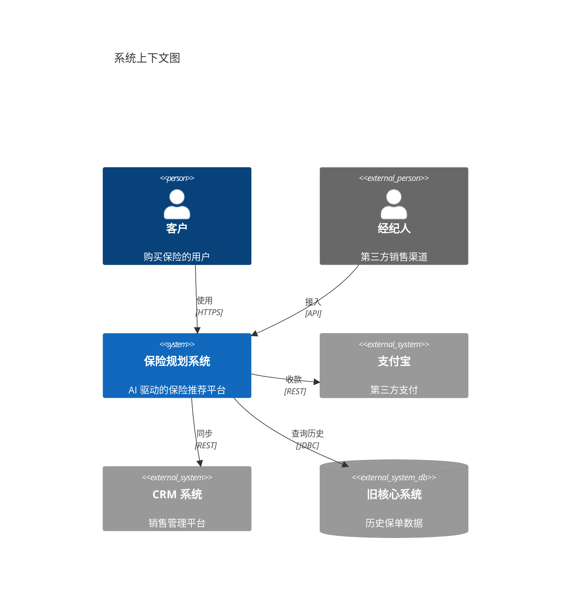

### C4Container

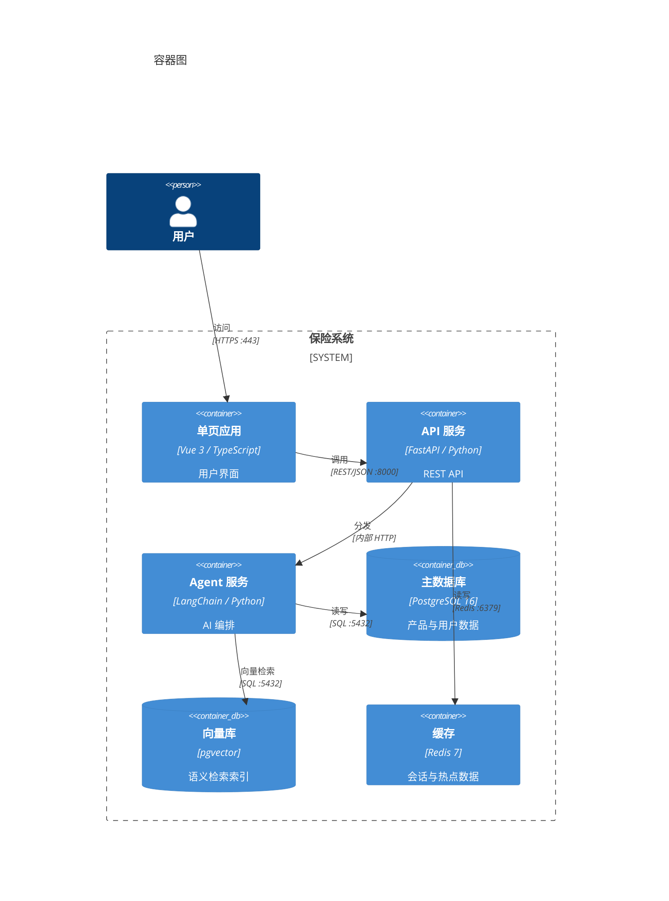

### C4Component

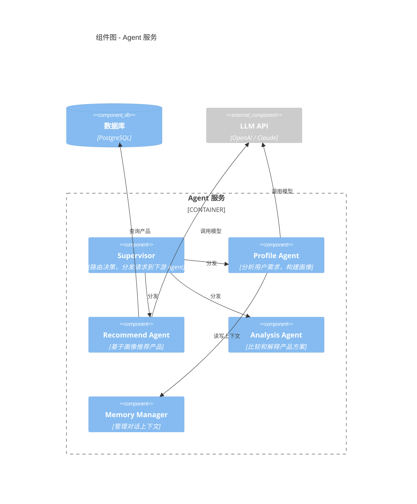

### UpdateRelStyle（关系样式）

```
UpdateRelStyle(person, system, $textColor="blue", $lineColor="blue", $offsetY="-10")
```

### UpdateLayoutConfig

```
UpdateLayoutConfig($c4ShapeInRow="4", $c4BoundaryInRow="2")
```

---

## classDef 和 click

### classDef 定义样式

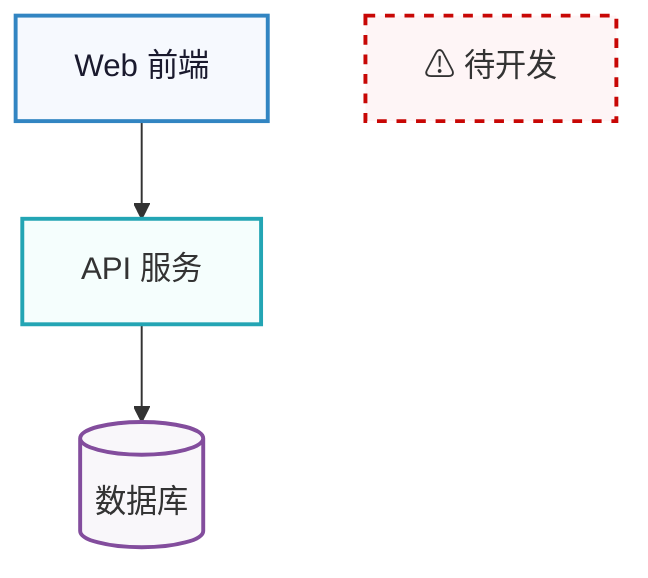

### 批量应用样式

```
class A,B,C frontend    %% 同时给多个节点应用同一 classDef
```

### click 交互

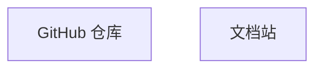

### click 回调（用于嵌入 HTML 时）

```
click A callback         %% 调用 JS 函数 callback(nodeId)
click A call myFunc()   %% 调用带参数的 JS 函数
```

---

## 高级技巧

### Edge ID（连接线样式定制）

```mermaid
graph LR
    A -- id1@--> B
    A -- id2@-.-> C

    style id1 stroke:#ff0000,stroke-width:3px
    style id2 stroke:#00aa00,stroke-dasharray:5
```

### 不可见连接线（布局控制）

用于强制特定节点的位置关系：

```mermaid
graph TB
    A["节点 A"]
    B["节点 B"]
    C["节点 C"]
    D["节点 D"]

    A --> B
    C --> D
    B ~~~ C    %% 不可见连接，让 B 和 C 对齐
```

### Tooltip

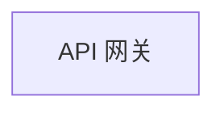

### 主题定制进阶

完整覆盖所有颜色变量以实现品牌一致性：

```
%%{init: {
  'theme': 'base',
  'themeVariables': {
    'primaryColor': '#e8f4f8',
    'primaryBorderColor': '#2196F3',
    'primaryTextColor': '#1a237e',
    'secondaryColor': '#e8f5e9',
    'secondaryBorderColor': '#4CAF50',
    'tertiaryColor': '#fff3e0',
    'tertiaryBorderColor': '#FF9800',
    'noteBkgColor': '#fffde7',
    'noteTextColor': '#333',
    'noteBorderColor': '#FFC107',
    'lineColor': '#546e7a',
    'textColor': '#1a1a2e',
    'mainBkg': '#ffffff',
    'clusterBkg': '#fafafa',
    'clusterBorder': '#e0e0e0',
    'fontFamily': 'Microsoft YaHei, PingFang SC, Arial, sans-serif',
    'fontSize': '16px'
  }
}}%%
```

---

## 布局控制高级技巧

### 声明顺序控制布局

Mermaid 的 dagre 引擎按代码中节点的**声明顺序**排列：
- 先声明的节点排在前面（TB模式中靠上，LR模式中靠左）
- 按阅读顺序声明：用户/入口在前，数据存储在后
- 研究表明，减少边交叉可提高读者理解准确率 30-40%

### 隐形链接

用 `~~~` 创建不可见的连接，强制两个节点相邻：
```
A ~~~ B  %% A和B相邻但无可见连线
```

### 间距调节

```
%%{init: {'flowchart': {'nodeSpacing': 80, 'rankSpacing': 60, 'curve': 'linear'}}}%%
```
- `nodeSpacing`: 同层节点间距（默认50）
- `rankSpacing`: 层间距（默认50）
- `curve`: `basis`(平滑) / `linear`(直线) / `stepBefore`(阶梯)

### ELK 布局引擎

大型复杂图使用 ELK 获得更智能的布局：
```
%%{init: {'flowchart': {'defaultRenderer': 'elk'}}}%%
```

---

## 中文特有问题与解决方案

### 问题 1：中文字体显示

**问题**：未指定中文字体时，汉字显示为方块或乱码。

**解决**：
```
%%{init: {'themeVariables': {'fontFamily': 'Microsoft YaHei, PingFang SC, Arial'}}}%%
```

字体优先级：Windows 使用 `Microsoft YaHei`，macOS 使用 `PingFang SC`，无中文字体时回退到 `Arial`。

---

### 问题 2：中文字符宽度导致布局错乱

**问题**：中文字符占 2 个英文字符宽度，导致节点大小不一致，布局混乱。

**解决**：限制每行字符数，使用 `<br/>` 换行：

```
A["AI 推荐引擎<br/>Recommendation Agent"]
B["PostgreSQL 16<br/>:5432 pgvector"]
```

**规则**：每行不超过 12 个汉字（约 25 个字符宽度）。

---

### 问题 3：节点 ID 使用中文

**问题**：中文 ID 在某些渲染环境下解析失败。

**错误示例**：
```
graph TB
    数据库 --> 服务器    %% 可能报错
```

**正确做法**：节点 ID 用英文，显示文本用中文：
```
graph TB
    db["数据库"]
    server["服务器"]
    db --> server
```

---

### 问题 4：subgraph ID 与显示文本

**语法**：
```
subgraph eng_id["中文显示标题"]
    内容节点
end
```

**注意**：`eng_id` 用于内部引用和样式定义，`"中文显示标题"` 是渲染时显示的文本。两者分开可以避免引用时中文编码问题。

---

### 问题 5：特殊字符转义

在节点标签中，以下字符需要用引号包裹或转义：

```
A["包含 (括号) 的标签"]
B["包含 [方括号] 的标签"]
C["包含 {大括号} 的标签"]
D["包含 >尖括号< 用 &gt; &lt;"]
```

---

### 推荐的中文架构图模板

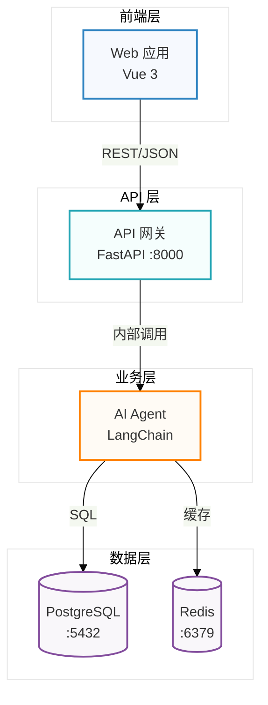
